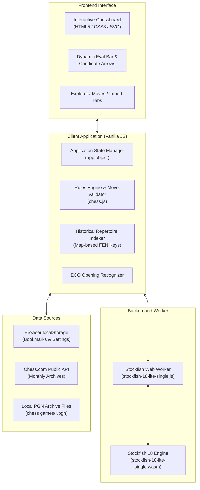

<div align="center">

# ♞ Chess Explorer & Personal Analyser

**A high-performance, privacy-first, in-browser chess workbench powered by Stockfish 18 WebAssembly.**  
*Explore your personal opening repertoire, analyze candidate moves, and review games—completely client-side.*

[](https://stockfishchess.org/)
[](https://developer.mozilla.org/en-US/docs/Web/JavaScript)
[](https://webassembly.org/)
[](#getting-started)
[](#architecture)

</div>

---

## 📖 Overview

**Chess Explorer** is a local-first web application designed for chess players who want serious post-game analysis and personal repertoire discovery without subscription fees, server latency, or data tracking.

Combining **Stockfish 18 Lite (WASM)** with a local **PGN game database indexer**, Chess Explorer allows you to play through positions, evaluate continuations with multi-PV engine arrows, and see exactly what *you* have played in that exact position across thousands of historical games from your Chess.com archives.

---

## ✨ Key Features

### ♟️ 1. Interactive Chessboard & Navigation
- **Smooth Drag-and-Drop & Click-to-Move**: Full legal move validation using `chess.js`.
- **Game Stepper**: Step through starting position, previous move, next move, or jump straight to the end.
- **Board Orientation**: Flip the board anytime to view positions from White or Black's perspective.
- **Promotion Dialog**: Interactive modal picker for Queen, Rook, Bishop, or Knight promotions.
- **Dynamic Indicators**: Clear turn badges and visual check/checkmate indicators.

### 🧠 2. Client-Side Stockfish 18 WASM Engine
- **In-Browser Compute**: Runs locally inside a dedicated Web Worker via WebAssembly—no backend server needed.
- **Multi-Line Analysis (MultiPV)**: Evaluate up to 5 concurrent principal variations simultaneously.
- **Customizable Engine Depth & Limits**: Tune depth (8–22 ply), analysis duration (1s–10s), or run in infinite evaluation mode.
- **Engine Strength Adjustment**: Scale engine skill levels from Beginner to Maximum strength (Skill Level 20).
- **Dynamic Evaluation Bar**: Smooth sigmoidal evaluation bar supporting centipawn scores and forced mate counters (`M#`).
- **SVG Move Arrows**: Color-coded candidate arrows overlaid directly onto the board for top engine suggestions.
- **Move Accuracy Classification**: Automated move classification (Book, Best, Excellent, Good, Inaccuracy, Mistake, Blunder) based on centipawn loss.

### 📊 3. Personal Historical Repertoire Explorer
- **Position Matching Engine**: Canonical transposition matching based on piece placement, active color, castling rights, and en passant square.
- **"What I Played Here"**: Instantly displays every move you played from the current position across your personal game archive.
- **Win / Draw / Loss Visualizer**: Win rates, score percentages, and colored outcome distributions for every branch.
- **Deep Historical Filters**:
  - **Time Control**: Bullet, Blitz, Rapid, Daily
  - **Color Played**: White, Black, or Both
  - **Game Result**: Wins, Draws, or Losses
  - **Date Range**: Filter by start and end dates
  - **Opponent Rating**: Minimum and maximum Elo thresholding

### 📥 4. Game Archiving & PGN Import
- **Chess.com Public API Sync**: Fetch and aggregate all public monthly PGN archives for any player handle.
- **Bulk PGN Parsing**: Drag and drop or upload multiple `.pgn` files simultaneously.
- **Interactive Game Replay**: Paste any PGN into the importer to load the full move history and step through every turn.
- **Local Cache**: Caches parsed game archives locally for instantaneous subsequent reloads.

### 🔖 5. Position Bookmarking & FEN Utilities
- **One-Click FEN Copy**: Quick-copy canonical FEN strings to your clipboard.
- **Saved Positions**: Bookmark critical positions with personal annotations and recognized opening titles.
- **Opening Recognition**: Integrated ECO opening book recognizing dozens of openings and variations (Sicilian, Ruy López, King's Indian, French, etc.).

---

## 🛠️ Architecture & Tech Stack



| Layer | Technology | Description |
|---|---|---|
| **Engine** | Stockfish 18 Lite (WASM) | High-performance WebAssembly compilation of Stockfish running in a Web Worker |
| **Logic** | `chess.js` | Complete chess rules, move validation, PGN parsing, and FEN generation |
| **Styling** | Modern CSS3 | Custom dark-themed layout with responsive CSS Grid, Flexbox, and SVG overlays |
| **Data** | Chess.com REST API & LocalStorage | Fetches public archives and persists preferences & bookmarks in the browser |
| **Serving** | Zero Dependencies | Pure static site served by any HTTP server (e.g., Python `http.server`) |

---

## 🚀 Getting Started

### Prerequisites

All you need is a modern web browser that supports WebAssembly and Web Workers (Chrome, Firefox, Safari, Edge) and Python 3 (or any local static file server).

> [!IMPORTANT]
> Because Web Workers and WebAssembly binaries cannot be loaded over `file://` URLs due to browser CORS/security restrictions, you must serve the directory over HTTP.

### Quick Start

1. **Clone the repository:**
   ```bash
   git clone https://github.com/your-username/chess-analyser.git
   cd chess-analyser
   ```

2. **Launch the local server:**
   ```bash
   ./start.sh
   ```
   *Alternatively, if you prefer manual startup:*
   ```bash
   python3 -m http.server 8080
   ```

3. **Open the application:**
   Navigate to [http://localhost:8080](http://localhost:8080) in your browser.

---

## 📁 Project Structure

```text
chess-analyser/
├── index.html                   # Application entrypoint & semantic UI layout
├── style.css                    # Dark-mode dashboard styles and responsive grid
├── script.js                    # Core application logic, indexing & engine manager
├── chess.js                     # Chess rules and move generation library
├── start.sh                     # Lightweight launcher script (Python HTTP server)
├── stockfish-18-lite-single.js  # Stockfish 18 Web Worker bridge
├── stockfish-18-lite-single.wasm# Stockfish 18 WebAssembly compiled engine
├── chess games/                 # Historical PGN archive collection (.pgn files)
└── README.md                    # Project documentation
```

---

## 🎯 Usage Guide

### Analyzing a Position
1. Move pieces freely on the board, or paste a PGN in the **Import** tab and click **Load on board**.
2. Click **Analyze position** (or configure analysis settings in the **Explorer** tab).
3. Observe:
   - **Evaluation Bar**: Shifts toward White (up) or Black (down) with current centipawn/mate score.
   - **Board Arrows**: Green arrow represents the #1 engine recommendation, followed by blue and orange arrows for alternate variations.
   - **Engine Lines**: Complete UCI principal variations translated to standard algebraic notation (SAN).

### Exploring Your Repertoire
1. Switch to the **Import** tab.
2. Enter your Chess.com username and click **Fetch games** (or load PGN files from disk).
3. Return to the **Explorer** tab.
4. As you play moves on the board, the **What I played here** panel automatically indexes your historical games and reports:
   - How often you reached this position.
   - Every move you tried and its historical win/loss rate.
   - Filter games on-the-fly by time control, rating, or date.

### Bookmarking Positions
1. Navigate to any position.
2. Click the star icon (**☆**) next to the FEN string.
3. Enter an optional note and click **Save**.
4. Access, load, or delete saved bookmarks anytime in the **Your bookmarks** section.

---

## ⚙️ Engine Settings & Configuration

The engine panel exposes real-time tuning parameters:

| Parameter | Options | Default | Description |
|---|---|---|---|
| **Depth** | 8 to 22 | `16` | Maximum calculation depth in half-moves (ply). |
| **Time** | Use depth, 1s, 3s, 5s, 10s | `Use depth` | Fixed thinking time per position. |
| **Lines (MultiPV)** | 1 to 5 | `3` | Number of concurrent best move lines analyzed. |
| **Strength** | Beginner (0) to Maximum (20) | `20` | Engine skill level cap for handicap/training. |
| **Infinite** | Checkbox (Toggle) | `false` | Keeps Stockfish searching indefinitely until stopped. |

---

## 🔒 Privacy & Local-First Philosophy

- **Zero Telemetry**: No analytics, third-party trackers, or ad networks.
- **Local Computation**: Stockfish runs directly on your CPU via WebAssembly; your positions and analysis never leave your machine.
- **Browser-Only Storage**: Saved positions, cached archives, and configuration options stay securely in your browser's `localStorage`.

---

## 🤝 Contributing

Contributions, feature requests, and bug reports are welcome!

1. Fork the Project
2. Create your Feature Branch (`git checkout -b feature/AmazingFeature`)
3. Commit your Changes (`git commit -m 'Add some AmazingFeature'`)
4. Push to the Branch (`git push origin feature/AmazingFeature`)
5. Open a Pull Request

---

## 📄 License

## License

This project is not currently licensed. Stockfish is licensed under the [GNU General Public License v3 (GPLv3)](https://www.gnu.org/licenses/gpl-3.0.en.html).
